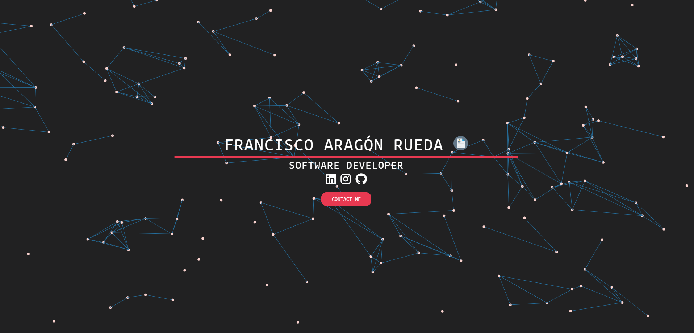

# Faragon-Portfolio

A particle-theme template as a landing page for your portfolio.

> [Demo](https://faragonrueda.tech/)



# Using the Template

  - Fork and Clone the repository

    ```
    $ git clone https://github.com/espfrant/faragon-portfolio
    ```
 
  - Go inside the main repository
  
    ```
    $ cd faragon-Portfolio
    ```
    
  - Modify `index.html` to change the names and links to point at your pages.
  
  - Upload your resume in the place of `*.pdf`
   
# Particle Feature

The particle feature was obtained with the help of this [particleground](https://github.com/jnicol/particleground). The changes in the particles such as speed, drift, colour, direction, density, etc. can be modified in `demo.js`. Refer to the above link for more details.


# References and Inspiration

This template is a minimal form of the [Particle Jekyll Template](https://github.com/nrandecker/particle).
